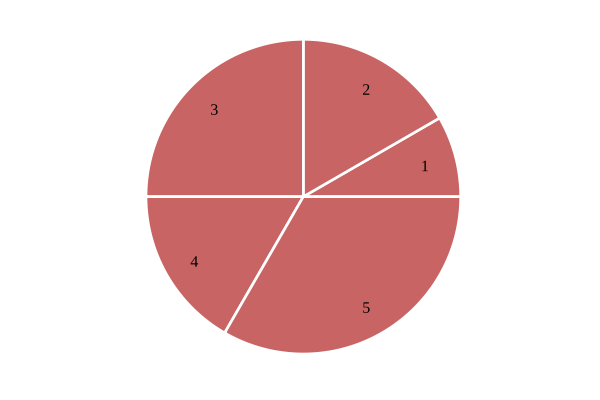
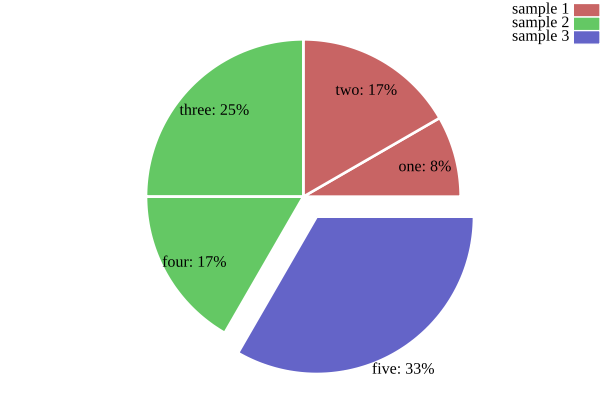

[](COPYING)
[](https://pkg.go.dev/github.com/benoitmasson/plotters/piechart)

# Pie chart

Pie chart plotter for [gonum.org/v1/plot](https://github.com/gonum/plot) package.

**Import** `"github.com/benoitmasson/plotters/piechart"` in your Go file, then **create** a new chart with `piechart.NewPieChart(plotter.Values{...})`.

See [documentation](https://pkg.go.dev/github.com/benoitmasson/plotters/piechart) for a complete feature overview.

### Examples

Such plots need to call `p.HideAxes()`, since axes are not relevant for this kind of chart.

#### Basic usage

```go
	// Initialize chart
	p := plot.New()
	p.HideAxes()

	// Setup pie chart
	pie, err := piechart.NewPieChart(plotter.Values{1, 2, 3, 2, 4})
	if err != nil {
		panic(err)
	}
	pie.Color = color.RGBA{200, 100, 100, 255} // red
	p.Add(pie)
```



#### Advanced usage

```go
	// Initialize chart
	p := plot.New()
	p.Legend.Top = true
	p.HideAxes()

	// Setup pie charts
	pie1, err := piechart.NewPieChart(plotter.Values{1, 2})
	if err != nil {
		panic(err)
	}
	pie1.Color = color.RGBA{200, 100, 100, 255} // red
	pie1.Total = 12
	pie1.Labels.Nominal = []string{"one", "two"}
	pie1.Labels.Values.Show = true
	pie1.Labels.Values.Percentage = true
	p.Add(pie1)
	p.Legend.Add("sample 1", pie1)

	pie2, err := piechart.NewPieChart(plotter.Values{3, 2})
	if err != nil {
		panic(err)
	}
	pie2.Color = color.RGBA{100, 200, 100, 255} // green
	pie2.Offset.Value = 3
	pie2.Total = 12
	pie2.Labels.Nominal = []string{"three", "four"}
	pie2.Labels.Values.Show = true
	pie2.Labels.Values.Percentage = true
	p.Add(pie2)
	p.Legend.Add("sample 2", pie2)

	pie3, err := piechart.NewPieChart(plotter.Values{4})
	if err != nil {
		panic(err)
	}
	pie3.Color = color.RGBA{100, 100, 200, 255} // blue
	pie3.Offset.Value = 8
	pie3.Total = 12
	pie3.Offset.X = vg.Length(10)
	pie3.Offset.Y = vg.Length(-15)
	pie3.Labels.Position = 1.1
	pie3.Labels.Nominal = []string{"five"}
	pie3.Labels.Values.Show = true
	pie3.Labels.Values.Percentage = true
	p.Add(pie3)
	p.Legend.Add("sample 3", pie3)
```



### License

GNU General Public License v3.0 or later.

See [COPYING](COPYING) to see the full text.
